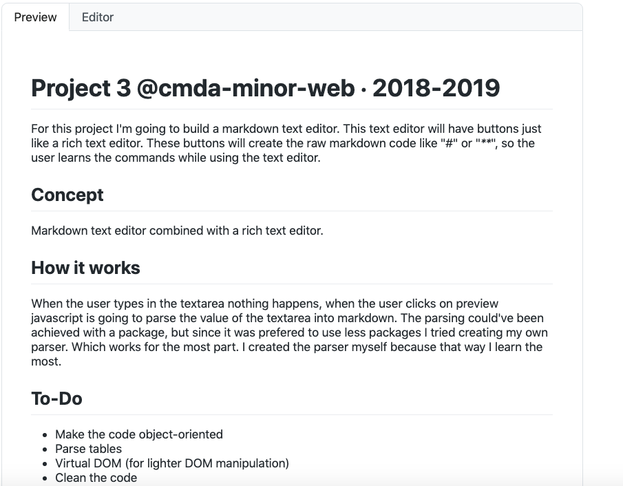

# Project 3 @cmda-minor-web · 2018-2019
For this project I'm going to build a markdown text editor. This text editor will have buttons just like a rich text editor. These buttons will create the raw markdown code like "#" or "****", so the user learns the commands while using the text editor.

## Table of Contents
- [Concept](#concept)
- [How it Works](#how-it-works)
- [To-Do](#to-do)
- [License](#License)

## Concept
Markdown text editor combined with a rich text editor.

## How it works
When the user types in the textarea nothing happens, when the user clicks on preview javascript is going to parse the value of the textarea into markdown. The parsing could've been achieved with a package, but since it was prefered to use less packages I tried creating my own parser. Which works for the most part. I created the parser myself because that way I learn the most.

## To-Do
- Make the code object-oriented
- Parse tables
- Virtual DOM (for lighter DOM manipulation)
- Clean the code
- Fix the bugs

Pasting the raw markdown of this README into the editor, works fine. Displayed in the image below.

## License
MIT © [Jesse Dijkman](https://github.com/jesseDijkman1)
